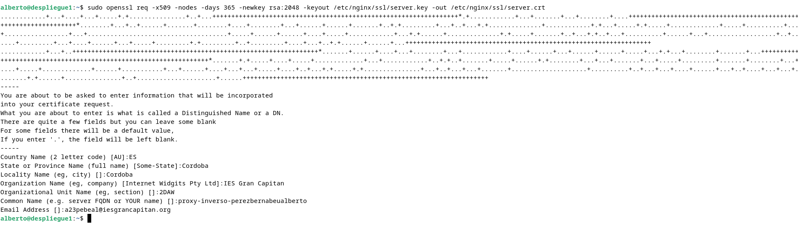
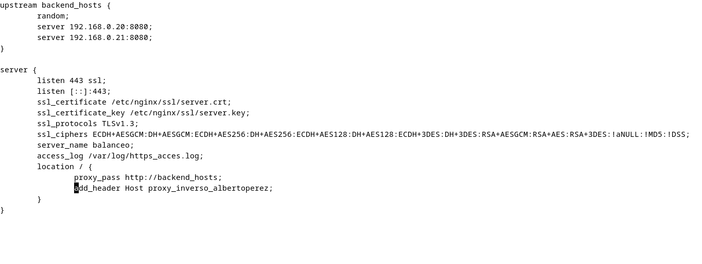
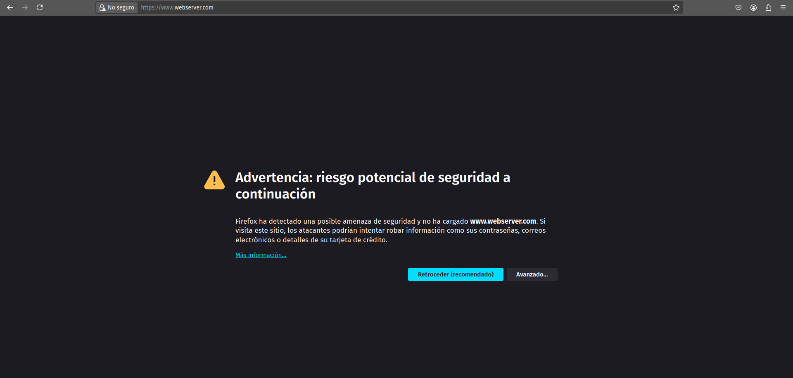
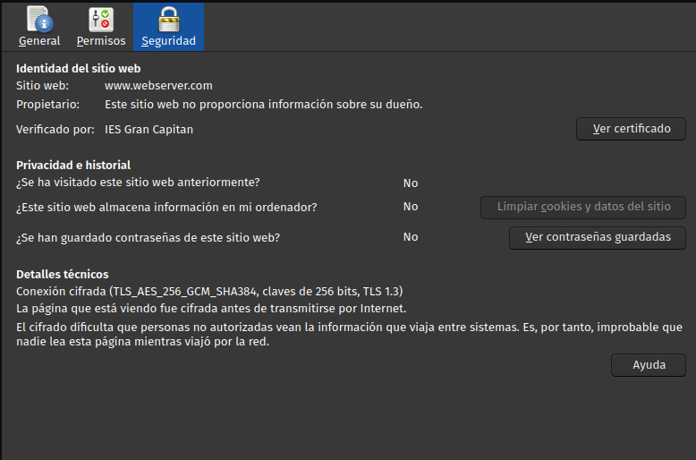
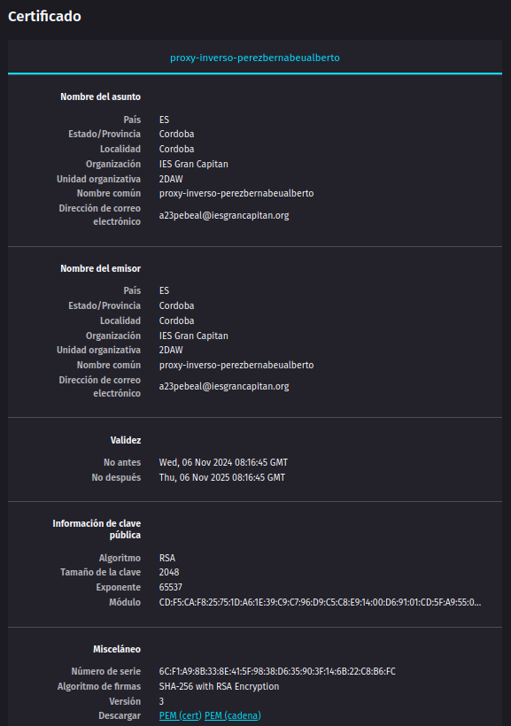
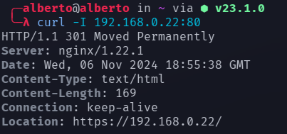

# Práctica 2.5 - Proxy inverso y balanceo de carga con SSL en NGINX

## Configurar cifrado con SSL

Para conseguir que la conexión entre los clientes y nuestro servidor sea segura, 
debemos configurar el cifrado SSL en nuestro proxy inverso. Para ello, crearemos 
un certificado digital con la herramienta OpenSSL.

```console
sudo mkdir /etc/nginx/ssl	# Creamos un directorio para almacenar el certificado y la clave privada del servidor.
sudo openssl req -x509 -nodes -days 365 -newkey rsa:2048 -keyout /etc/nginx/server.key -out /etc/nginx/ssl/server.crt
```

Y se nos pedirá que indiquemos una serie de datos:



Tras crear el certificado y la clave privada, será necesario añadir algunas líneas en el archivo de configuración 
localizado en /etc/nginx/sites-available. Esta será la nueva configuración:



Permitimos la conectividad a través del puerto 443 con ufw ejecutando:

```console
sudo ufw allow 443/tcp
```
Ahora, si intentamos acceder desde el navegador de nuestra máquina anfitriona, aparecerá una advertencia: 



Esto se debe a que el navegador no reconoce a la organización que expide nuestro certificado como fiable, pero 
no impide que entremos a la página y visualicemos el contenido.

Además, si entramos a la información de seguridad, podemos comprobar que efectivamente la conexión está ahora cifrada:



Y también podemos consultar los datos del certificado:




Actualmente, sólo podemos acceder al contenido a través de HTTPS ya que el proxy sólo "escucha" a través del puerto 443. 
Podemos también hacer que escuche peticiones HTTP por el puerto 80 y redirigirles hacia una conexión segura.

Para ello, volvemos a modificar el archivo de configuración de /etc/nginx/sites-available y le agregamos el siguiente bloque: 

```console
server {
	listen 80;
	server_name balanceo;
	access_log /var/log/nginx/http_access.log;
	return 301 https://$host$request_uri;
}
```

Por una cuestión del caché de los navegadores, es posible que entre las cabeceras no encontremos 
el código HTTP que esperamos (301), ya que en lugar de tratar de solicitar un recurso del servidor, 
se está cargando información almacenada en caché para ahorrar recursos. Para evitar este problema, 
podemos utilizar curl para comprobar que la redirección se está realizando correctamente:



Donde se nos indica que el contenido al que tratamos de acceder no se encuentra en 192.168.0.22:80 sino 
que deberíamos tratar de acceder a él desde https://192.168.0.22/.

## Cuestiones finales

### Cuestión 1

El error 'ERR_SSL_PROTOCOL_ERROR' indica que algo está impidiendo el encriptado de la conexión con la página, a pesar de que existe 
un certificado digital SSL que debería estar llevando la tarea de encriptado. La manera de solucionarlo será eliminar tanto el certificado 
como la clave privada del servidor (en este caso almacenadas en /etc/nginx/ssl/enrico-berlinguer) y generar un certificado y clave 
nuevos utilizando OpenSSL.

### Cuestión 2

Cuando el navegador arroja la advertencia NET::ERR_CERT_REVOKED al intentar acceder a un sitio web, es indicativo de que el servidor ha 
devuelto unas credenciales incorrectas. Esto puede deberse a que un tercero esté intentando hacerse pasar por el propietario del dominio 
al que estamos intentando acceder o a que la entidad certificadora del dominio le haya retirado su certificado SSL o que el certificado se 
haya expedido al sitio web equivocado, haciendo que las credenciales sean efectivamente erróneas.

Para solucionar este problema, debemos ponernos en contacto con la entidad certificadora que expidió el certificado que está provocando el 
error y nos emitan un nuevo certificado correcto para nuestro sitio web.


